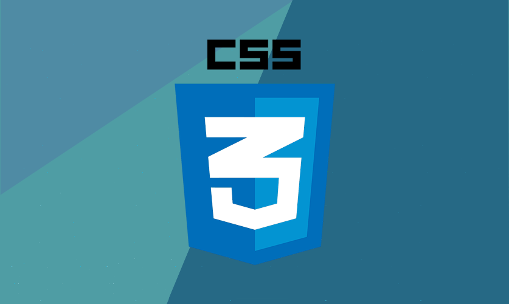

# Cascading Style Sheets (CSS)

El lenguaje de marcas HTML surgió como una forma de definir un documento, pero nunca para darle estilos.

Es en la versión HTML 3.2 cuando comienzan a usarse etiquetas como "font" y otras que generan documentos HTML poco estructurados y con demasiadas etiquetas de formato.

Estos documentos eran de alguna forma caóticos y poco claros. No se podía distinguir de forma sencilla la semántica ni la estructura del documento.

La revisión de HTML 4 aportó la creación del etiquetado de estilos para definir, por un lado el formato, y por otro el contenido de un documento, estableciendo que: 

1. La página web (documento HTML) solo debe contener información.
2. El formato o estilos se debe definir en las llamadas hojas de estilo (CSS).
3. Las hojas de estilo son estructuras de marcas que definen el formato de los elementos. Se pueden incluir dentro del archivo HTML o fuera de él enlazando el archivo .css en la página.

## Aplicando CSS

Para aplicar estilos a nuestras páginas podemos hacerlo de tres formas:

1. En la propia página HTML con una etiqueta "style". No es muy recomendable ya que no permite la reutilización de código.
2. Dentro de una etiqueta HTML llamada "style". Tampoco sería muy recomendable ya que tampoco permite la reutilización de código, también lo sobrecarga y muchas veces complica el código de manera innecesaria.
3. En una hoja de estilos independiente. Este es el método recomendado ya que permite reutilización y separa claramente el HTML y el CSS.

## Sintaxis CSS

La sintaxis de un estilo es muy simple e intuitiva. Su estructura consta de una serie de reglas que describen la forma en la que se visualiza cada uno de los elementos. Las reglas están definidas en el **selector**, que es el se encarga de saber a que etiquetas HTML debemos de aplicar los estilos mediante la definición de sus propiedades.

La estructura sería la siguiente:

    SELECTOR { 
        PROPIEDAD_1:VALOR_1;
        PROPIEDAD_2:VALOR_2;
        PROPIEDAD_3:VALOR_3;
        ...
    }

La propiedad sería el estilo que queremos modificar del elemento seleccionado, y el valor sería el estado que toma dicha propiedad.

Veamoslo con un ejemplo:    

    h2 {
        color: rgb(0, 255, 0);
        text-align: center;
    }

En el anterior ejemplo el selector sería H2, es decir, que las reglas de dentro aplicarían a dichas etiquetas HTML que cumplan con dicha condición (en este caso, estamos diciendo que aplica a todas las etiquetas h2)

Luego, dentro del selector tenemos dos declaraciones, la primera dice que el color de las letras será el verde, y la segunda dice que la posición del texto sera centrada.

## Como comenzar

Podemos empezar a ver los ejemplos que estan numerados dentro de esta carpeta (01_CSS_Introduccion.html)

## Bibliografía
- [https://www.w3schools.com/css/](https://www.w3schools.com/css/)
- [https://developer.mozilla.org/es/docs/Web/CSS](https://developer.mozilla.org/es/docs/Web/CSS)
- [https://www.w3.org/TR/CSS/#css](https://www.w3.org/TR/CSS/#css)

### Herramientas

- [Editor de fotografía on-line](https://pixlr.com/)
- [Creación de bocetos](https://ninjamock.com/)
- [Degradados CSS](http://www.colorzilla.com/gradient-editor/)

### Inspiración:
- <https://www.awwwards.com/>
- <http://www.logogala.com/>
- <https://mediaqueri.es/>
- <http://www.webcreme.com/>

### Frameworks CSS

- [Bootstrap](https://tailwindcss.com/)
- [W3.css](https://www.w3schools.com/w3css/w3css_downloads.asp)
- [Codyhouse](https://codyhouse.co/)
- [Tailwind](https://tailwindcss.com/)

### Varios

- [CV en HTML5 y CSS3](http://www.rleonardi.com/interactive-resume/)
- [Ejercicios HTML y CSS](http://desarrolloweb.dlsi.ua.es/libros/html-css/ejercicios)
- [Practicar CSS](https://flukeout.github.io/)
- [Landscape vs Portrait](https://pickaso.com/2019/landscape-portrait-screenshots-app)
