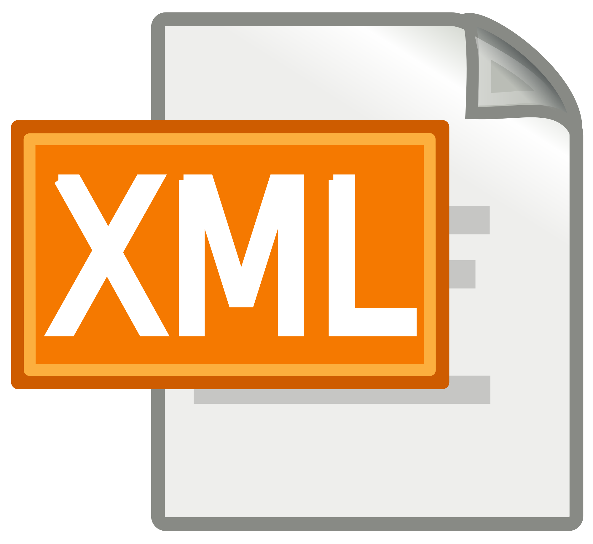

# eXtensible Markup Language (XML)

## Introducción

Si bien HTML está concebido para presentar la información, se limita a crear estructuras básicas de textos para facilitar su comprensión por el ser humano, no permite la transmisión de objetos o estructuras de datos que los sistemas informáticos comprendan mejor. Para este fin es donde entran los lenguajes de marcas o de listas como XML y JSON.

XML nos va a ayudar mucho dentro de la programación, como por ejemplo:

1. Crear documentos XML que seran leidos por programas, como ficheros de propiedades o ficheros de configuración. Se usan ficheros XML para dar información adicional sobre la configuración del programa. 

2. Intercambio de información entre sistemas informáticos o programas. Suele ser un formato de intercambio de información estandar.

XML entra dentro del concepto de metalenguaje, es decir, es un conjunto de reglas para formar documentos de etiquetas.

## Caracteristicas

1. Su principal característica consiste en que puede especificar reglas para etiquetas definidas por él mismo, es decir, puede definir su propio lenguaje de marcado.

2. La información que esta dentro de un XML esta estructurada, lo que facilita el procesamiento por programas informáticos.

3. XML no es un lenguaje como tal, ya que no posee estructuras de control. Es por esto por lo que se le denomina metalenguaje.

4. <b>XML es un metalenguaje</b>, igual que HTML, pero se ha definido de forma que no está limitado a un vocabulario, industria o utilización en particular, siendo la personificación de la extensibilidad para Internet.

5. Podemos definir reglas de validación, mediante DTD o XSD.

6. XML se almacena en formato de texto plano.

7. Es de código abierto (www.w3c.org).

## Sintaxix XML

XML es un lenguaje de etiquetas; esto quiere decir que cada paquete de información está delimitado por dos etiquetas, como se hace también en el lenguaje HTML, pero XML separa el contenido de la presentación.

    <nombre>Julia</nombre>

La etiqueta "nombre" identifica la palabra Julia como un nombre de persona, XML se centra en el significado del texto que encierra su etiqueta y no en la apariencia de cómo se muestre el texto en la web.

Una etiqueta o tag es una marca utilizada por el lenguaje para delimitar a un elemento. Los lenguajes de marcado usan su juego específico de marcas. Usaremos el carácter "<", el "/" o el carácter ">".

## Como comenzar
Primero ver la unidad formativa 3.2 XML

Luego, podemos empezar a ver los ejemplos que estan numerados dentro de esta carpeta (01_XML_Persona.xml)

## Bibliografía
- [https://www.w3schools.com/xml/](https://www.w3schools.com/xml/)
- [https://developer.mozilla.org/es/docs/Web/XML/XML_introduction](https://developer.mozilla.org/es/docs/Web/XML/XML_introduction)
- [https://www.w3.org/XML/](https://www.w3.org/XML/)

