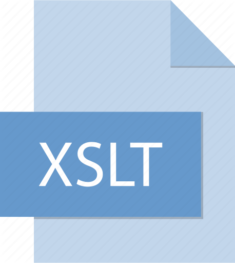

# EXtensible Stylesheet Language Transformations (XSLT)

Permite convertir documentos XML a otros formatos (por ejemplo, HTML). Una plantilla podra ser la siguiente (fichero con extension xsl):

	<?xml version="1.0" encoding="UTF-8"?>
	<xsl:stylesheet version="1.0" xmlns:xsl="http://www.w3.org/1999/XSL/Transform">
		<xsl:template match="/">
			<!-- AQUÍ VA LA ESTRUCTURA DEL DOCUMENTO HTML -->
		</xsl:template>
	</xsl:stylesheet>

Para enlazar un fichero xsl con un fichero xml debemos de poner la 
siguiente linea en el FICHERO XML:

	<?xml-stylesheet type="text/xsl" href="cruceros.xsl"?>
	
despues de la linea

	<?xml version="1.0" encoding="UTF-8"?>

## Estilos CSS

Son estilos y formatos que se puden aplicar a XML o HTML
Para meter los estilos al fichero "cruceros.xml" debemos de poner
la siguiente linea:

	<?xml-stylesheet type="text/css" href="cruceros.css" ?>

Despues de 

	<?xml version="1.0" encoding="UTF-8"?>

## INSTRUCCIONES PARA VISUALIZAR ESTE EJEMPLO EN UN NAVEGADOR WEB

Los ficheros de este ejemplo hay que desplegarlos en algun servidor como puede ser TOMCAT o APACHE
habitualmente. Tambien se puede utilizar algun extension de Visual Studio Code como "live server"
para ejecutarlo.

## Visual Studio Code + Live Server
----------------------------------
1. Primero debemos de instalar VSC
2. Bajarse la extension "Live Server". Esto emula un servidor web en el puerto 5500
3. Abrir la carpeta 08_XSLT dentro del VSC
4. Ponerse sobre el fichero "cruceros.xml", pulsar boton derecho y elegir la opcion
"Open With Live Server"
5. Para apagar el servidor hay una opcion abajo a la derecha del VSC "Cerrar Port:5500"

## APACHE
--------
1. Instalar algun APACHE (XAMPP) 
2. Ir a la carpeta "HTDOCS" donde tengamos instalado nuestro APACHE
3. Dentro de esta carpeta pegar la carpeta 08_XSLT
4. Arrancar el servidor apache
4. Abrir el navegado e ir al a ruta determinada EJ: http://localhost/08_XSLT/cruceros.xml

## ECLIPSE + TOMCAT
------------------
1. Configurar eclipse con el servidor TOMCAT
2. Crear un nuevo proyecto dinamico (dinamic web proyect) y lo llamamos "08_XSLT"
3. Una vez creado, vamos a la carpeta "webcontent" y pegamos todos los ficheros de ejemplo 08_XSLT (La carpeta css y los ficheros "cruceros")
4. Arrancamos el servidor con el proyecto desplegado
5. Abrir el navegado e ir al a ruta determinada (ojo, revisar las URLs de los ejemplos) EJ: http://localhost/08_XSLT/cruceros.xml

