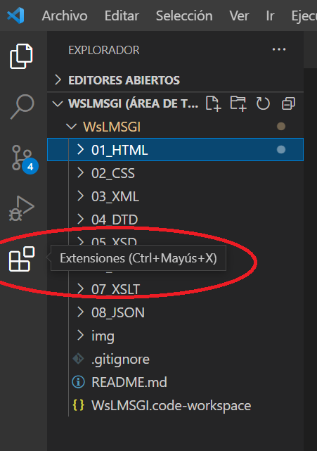
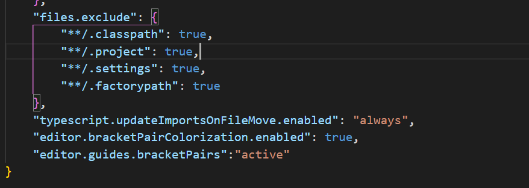

# Lenguajes de Marcas y Sistemas de Gestión de la Información

Workspace con teoría y ejemplos sobre la asignatura de Lenguajes de Marcas y Sistemas de Gestión de la Información.

Los proyectos están numerados y contienen teoría y ejemplos.

Este Workspace está realizado con <b>Visual Studio Code (VSC)</b>, pero puede ser utilizado por cualquier IDE.

- Enlace de VSC : <https://code.visualstudio.com/>
- Enlace para descargar: <https://code.visualstudio.com/download>.

## Extensiones recomendadas de Visual Studio Code

Se recomienda instalar las siguientes extensiones en VSC

1. Open in Browser, para poder abrir carpetas desde VSC
2. XML, para poder trabajar con XML principalmente
3. XML Tools, para poder trabajar con XPath principalmente
4. Live Server, para poder arrancar un servidor ligero de manera sencilla. Se recargaran las páginas HTML de manera automática.
5. Markdown Preview Enhanced, para ver los ficheros con extensión ".md"

Optativas:

1. Markdown PDF, para convertir ficheros ".md" a ".pdf"

Para instalar las extensiones, primero pulsar en el enlace de la barra izquierda de navegación "extensiones", buscarlas e instalarlas.

## Configuraciones especiales

Si queremos hacer que los simbolos especiales esten coloreados, como por ejemplo los simbolos **()[]{}** y conseguir que el código sea más legible, debemos añadir las siguientes líneas de código en el fichero de configuración **settings.json** (al final de fichero, antes del cierre **}**): 

    "editor.bracketPairColorization.enabled": true,
    "editor.guides.bracketPairs":"active"

Para abrir el fichero **settings.json**:

1. pulsar **ctrl + mayusculas + p**
2. Escribir **settings.json**, a continuación debemos elegir de "Abrir la configuración (JSON)"

Debería quedar algo parecido a la siguiente imagen

## Bibliografía

Dentro de cada unidad podremos encontrar bibliografía especifica. Las siguientes páginas podemos considerarlas como bibliografía genérica.

- <https://www.w3schools.com>
- <https://www.w3.org/standards/webdesign/htmlcss>
- <https://developer.mozilla.org/es/docs/Web>
- <https://uniwebsidad.com/>

## Otros enlaces de interes

- [Tutorial de Git con VSC](https://lemoncode.net/lemoncode-blog/2017/12/12/git-y-visual-studio-code)
- [Tutorial de MarkDown](https://www.markdownguide.org/basic-syntax/)

